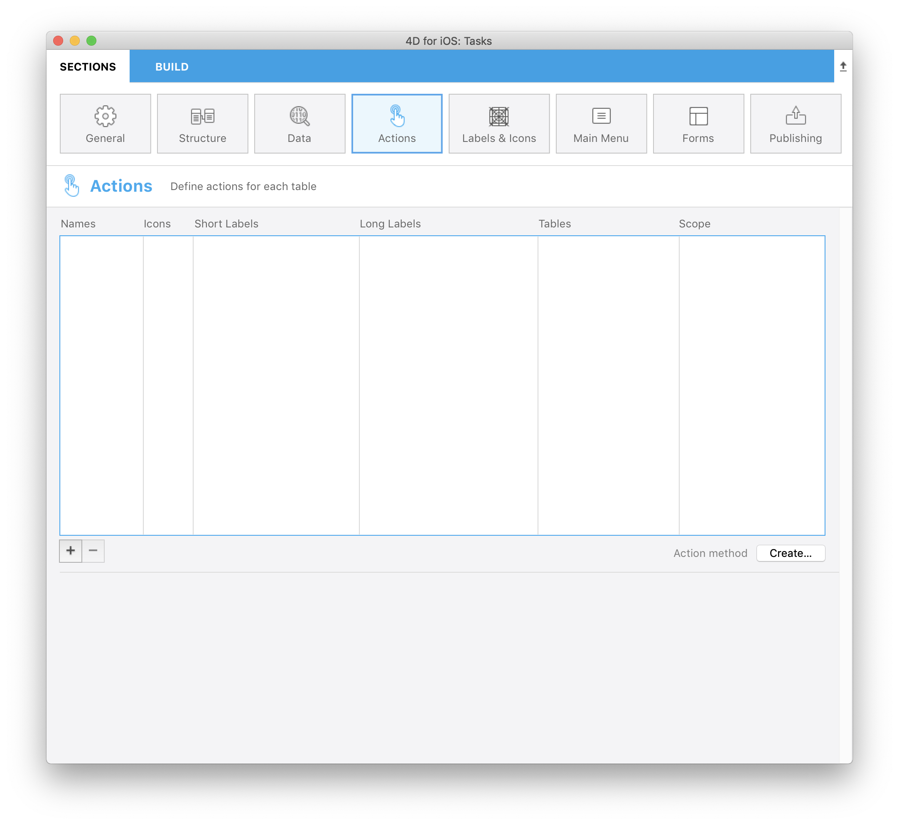
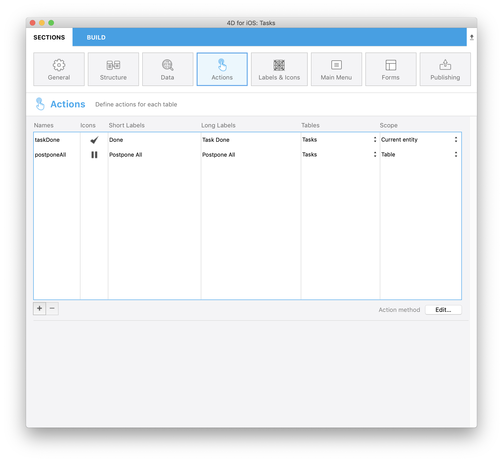

Basically what we want to do in a **Task app** is changing the **status** and the **percentage of completion** of a Task individually. And more globally we want to **change all tasks status** to postponed or in Progress for example.

Download the **Starter project** and go right to the **Actions section**.

<div markdown="1" style="text-align: center; margin-top: 20px; margin-bottom: 20px">

<a class="button"
href="../assets/en/#">STARTER PROJECT</a>

</div>

As we've seen before in the [Action section documentation](actions.html#ios-app-side), you can define action for two levels:

* Entity actions
* Table actions

Let's focus first on Entity actions


## Entity actions

### STEP 1. Entity action in Action section

In this Actions section, you will be able to define all your actions **names**, **icons**, **labels**, the **table** you want the action to be available on and the **scope** you want actions to be applied on.

The action section is quite empty at the beginning so click the **Plus button** to add your first action!



Let's define first an action that will **change a task status** to Complete and put the **percentage of completion** to 100%.

To define this action:

* Enter **Done** in **Names field**
* Select the **Done icon** from the icon library
* Enter **Done** in **Short Labels**
* Enter **Task Done** in **Long Labels**
* Select the **Tasks** table from **Tables** list
* Select **Current record** from **Scope** list


### STEP 2. Create and edit the Action method

Now that your action is defined in the Project Editor, you have to create the [**On Mobile App Action**]() database Method.


Do to so click on **Create button** at the bottom right of the action table and enter the following code in the On Mobile App database method:

```code4d
C_OBJECT($Obj_result;$Obj_in;$Obj_;$Obj_param)
$Obj_in:=$1
$Obj_param:=$Obj_in.parameters

Case of 
		
	: ($Obj_in.action="Done")
		$Obj_:=New object(\
		"dataClass";$Obj_param.dataClass;\
		"ID";$Obj_param.entity.primaryKey;\
		"CompletePercentage";100)
		$Obj_result:=ModifyStatus ($Obj_)
	Else 
		
End case 
$0:=$Obj_result

```

### STEP 3. Create a "Modify Status" Method

Once your database method has been edited, you have to create a **Modify Status Method** to make the job :

```code4d
C_OBJECT($Obj_in;$Obj_out;$selection;$record;$status)
$Obj_in:=$1
$Obj_out:=New object("success";False)

If (Length(String($Obj_in.dataClass))>0)
	
	$Obj_dataClass:=ds[$Obj_in.dataClass]
	
	If ($Obj_in.ID#Null)
		
		$selection:=$Obj_dataClass.query("ID="+String($Obj_in.ID))
		
		If ($selection.length>0)
			$record:=$selection.first()
			$record.CompletePercentage:=$Obj_in.CompletePercentage

			Case of 
				: ($Obj_in.CompletePercentage=100)
				$record.Status:=3
					
				Else 
				
			End case 
			
			$status:=$record.save()
			
			If ($status.success)
				$Obj_out.success:=True
				$Obj_out.dataSynchro:=True
			Else 
				$Obj_out:=$status
			End if 
		Else 
			$Obj_out.errors:=New collection("No record found with ID "+String($Obj_in.ID))
		End if 
	Else 
		$Obj_out.errors:=New collection("The record ID must be specified")
	End if 
Else 
	$Obj_out.errors:=New collection("The dataClass name must be specified")
	
End if 

$0:=$Obj_out

```

Build and Run and voila! Your **Done action** is available when you swipe a cell in Listform as well as when you click on the **generic action button** in the navigation bar of the Detail form.


## Table actions

### STEP 1. Table action in Action section

Now, imagine that you are going on hollidays and you want to change all your tasks status to **Postponed**. 

Let's define this action from the Action section:

* Enter **Postponed All** in **Names field**
* Select the **Postponed icon** from the icon library
* Enter **Postponed All** in **Short Labels**
* Enter **Postponed All** in **Long Labels**
* Select the **Tasks** table from **Tables** list
* Select **Table** from **Scope** list



### STEP 2. Edit the Action method

Clic on **Edit button** at the bottom right of the action table to complete the On Mobile App Action database method :

```code4d
C_OBJECT($Obj_result;$Obj_in;$Obj_;$Obj_param)
$Obj_in:=$1
$Obj_param:=$Obj_in.parameters

Case of 
	: ($Obj_in.action="Done")
		$Obj_:=New object(\
		"dataClass";$Obj_param.dataClass;\
		"ID";$Obj_param.entity.primaryKey;\
		"CompletePercentage";100)
		$Obj_result:=ModifyStatus ($Obj_)
		
	: ($Obj_in.action="PostponedAll")
		$Obj_:=New object(\
		"dataClass";$Obj_param.dataClass)
		$Obj_result:=PostponedAll ($Obj_)
		$Obj_result.dataSynchro:=True
		
	Else 
		
End case 
$0:=$Obj_result

```


### STEP 3. Create a "Postponed All" Method

As a Modify status method has been create, create a new **PostponedAll** project method that will deal with all record status:

```code4d
C_OBJECT($Obj_in;$Obj_out;$selection;$record;$status)
$Obj_in:=$1
$Obj_out:=New object("success";False)

If ($1.dataClass#Null)

	For each ($entity;ds[$1.dataClass].all())
		$entity.Status:=4
		$entity.save()
	End for each 
Else 
	$Obj_out.errors:=New collection("No Selection")
End if 

$0:=$Obj_out

```

Build and Run your app. You will find a new **generic button** in the navigation bar of your Lisform. Clic on it to access to the **Postponed All action**.


## Where to Go From Here? 

Congratulations! You've just added 2 actions to your iOS app. You can now able to add all actions you need to your Tasks app !


You can download the **Final project** that includes various actions:

<div markdown="1" style="text-align: center; margin-top: 20px; margin-bottom: 20px">

<a class="button"
href="../assets/en/#">FINAL PROJECT</a>

</div>

