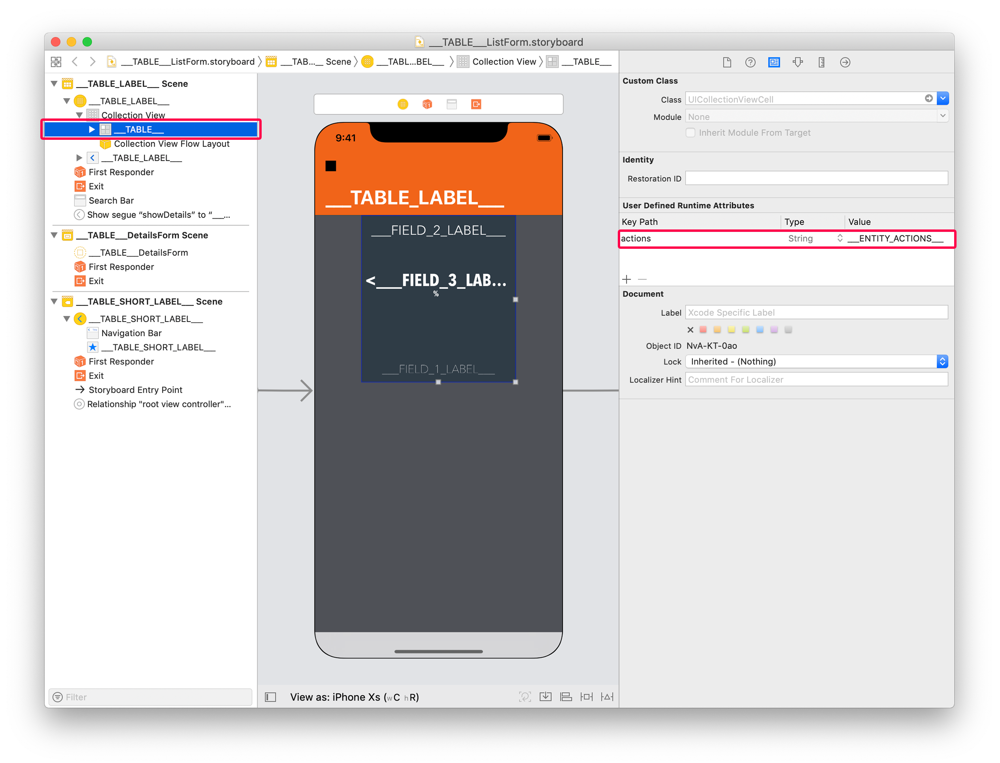

> **OBJECTIVES**
> 
> Add actions to custom List and Detail forms templates.


> **PREREQUISITES**
> 
> Click [here](prerequisites.html) to see what you'll need to get started!


In this tutorial, we are going to see how easy it can be to **add actions to custom templates**.

## STEP 1. Download the Starter Project

To begin, download the Starter Project, which includes:

* 2 custom List form templates (TasksList and TasksCollection)
* 1 custom Detail form template (TasksDetail)
* a Tasks.4dbase file

<div markdown="1" style="text-align: center; margin-top: 20px; margin-bottom: 20px">

<a class="button"
href="https://github.com/4d-for-ios/tutorial-AddingActionToTemplates/archive/1dc5aecfbea62a9999d571cb1a956f1ef6983111.zip">STARTER PROJECT</a>

</div>

## STEP 2. Add custom templates to 4D for iOS Project

First, drop:

* **TasksList** and **TasksCollection** template folders in *Tasks.4dbase/Resources/Mobile/form/list* folder 


* **TasksDetail** template folders in *Tasks.4dbase/Resources/Mobile/form/detail folder*


## STEP 3. Add actions in List forms

As we have seen previously in the [actions section description](actions.html), two types of actions are availble (Table actions and Entity actions). 

Let's first open the ```list/TasksList/Sources/Forms/Tables/___TABLE___/___TABLE___ListForm.Storyboard``` file.

### Add actions to TasksList custom template

#### A. Add Table action Tag

Select the **List form Controller** and add this line in the **User Defined Runtime Attributes** (Identity inspector):

* Key Path: ```actions```
* Type: ```String```
* Value: ```___TABLE_ACTIONS___```


#### B. Add Entity action Tag

Select the Animatable Table View and add this line in the **User Defined Runtime Attributes** (Identity inspector):

* Key Path: ```actions```
* Type: ```String```
* Value: ```___ENTITY_ACTIONS___```


Your custom template is ready to display actions! 

You can select the TaskList custom template from the **Forms section** and add the following fields:


Now let's add action tags to the TasksCollection custom template

### Add actions to TasksCollection custom template

To do so, open the ```list/TasksCollection/Sources/Forms/Tables/___TABLE___/___TABLE___ListForm.Storyboard``` file.

#### A. Add Table action Tag

The process is quite as similar as TasksList custom template's process.

Select the **List form Controller** and add this line in the **User Defined Runtime Attributes** (Identity inspector):

* Key Path: ```actions```
* Type: ```String```
* Value: ```___TABLE_ACTIONS___```


#### B. Add Entity action Tag

For entity, the way you display actions is quite different than TableView: swipe action are not really adapted to CollectionViews.

So with collection views, the best way to display actions is to use a **long pressure** gesture on the cells you want to interact with.

For that, select the collectionView cell and add this line in the **User Defined Runtime Attributes** (Identity inspector):

* Key Path: ```actions```
* Type: ```String```
* Value: ```___ENTITY_ACTIONS___```



To optimize the interaction rendering, you can add a scale effect with a haptic feedback adding the following line in the **User Defined Runtime Attributes** (Identity inspector):

* Key Path: ```touch.zoomScale```
* Type: ```Number```
* Value: ```0,96``` (adapt the scale ratio depending on the result you want to get)

You can select the TasksCollection custom template from the **Forms section** and add the following fields:


## STEP 4. Add actions in Detail forms
 
In Detail forms, you can use the **generic button** in the navigation bar or **create easily your own custom action button**. In both cases, you have to add tags.

For generic button embedded in the navigation bar, select the Controller and add this line in the **User Defined Runtime Attributes** (Identity inspector):

* Key Path: ```actions```
* Type: ```String```
* Value: ```___ENTITY_ACTIONS___```


In our tutorial, we want to build our own generic button. For that, open the ```detail/TasksDetail/Sources/Forms/Tables/___TABLE___/___TABLE___DetailsForm.storyboard``` file.

Open it, select the button at bottom right and add this line in the **User Defined Runtime Attributes** (Identity inspector):

* Key Path: ```actions```
* Type: ```String```
* Value: ```___ENTITY_ACTIONS___```


As you can see, a few visual buttons are missing in the Storyboard file. You can actually find those visuals in the  **Resources folder** template. They will be included in the project during the build process.

For example for the **moreButton.imageset**:


You can select the TasksDetail custom template from the **Forms section** and add the following fields:


Congratulations, your Tasks iOS app is now complete and includes actions in List form and Detail form !


<div markdown="1" style="text-align: center; margin-top: 20px; margin-bottom: 20px">

<a class="button"
href="https://github.com/4d-for-ios/tutorial-AddingActionToTemplates/releases/latest/download/tutorial-AddingActionToTemplates.zip">FINAL PROJECT</a>

</div>

