<div markdown="1" class = "objectives">

**OBJECTIVES**

Define action parameters to edit the content of your app.

</div>

In the [previous tutorial](define-first-action.html), we discovered how to execute 4D code from an iOS app by defining actions from the [Actions section](actions.html).

In this tutorial, we're going to go further and create:

* an Add action to **create a new task**,
* an Edit action that will allow you to **edit existing tasks** from the iOS app,
* a Delete action to **delete an entity**, and
* an action that will enable you to **email a comment for a specific task**.

To begin, let's first download the **Starter Project** based on our existing Tasks iOS app.

<div markdown="1" style="text-align: center; margin-top: 20px; margin-bottom: 20px">

<a class="button"
href="../assets/en/actions/ActionParametersStarterProject.zip">STARTER PROJECT</a>

</div>

## STEP 1. Add action

Let's begin simple. Open the Tasks mobile project and go directly to the **Actions section**. 

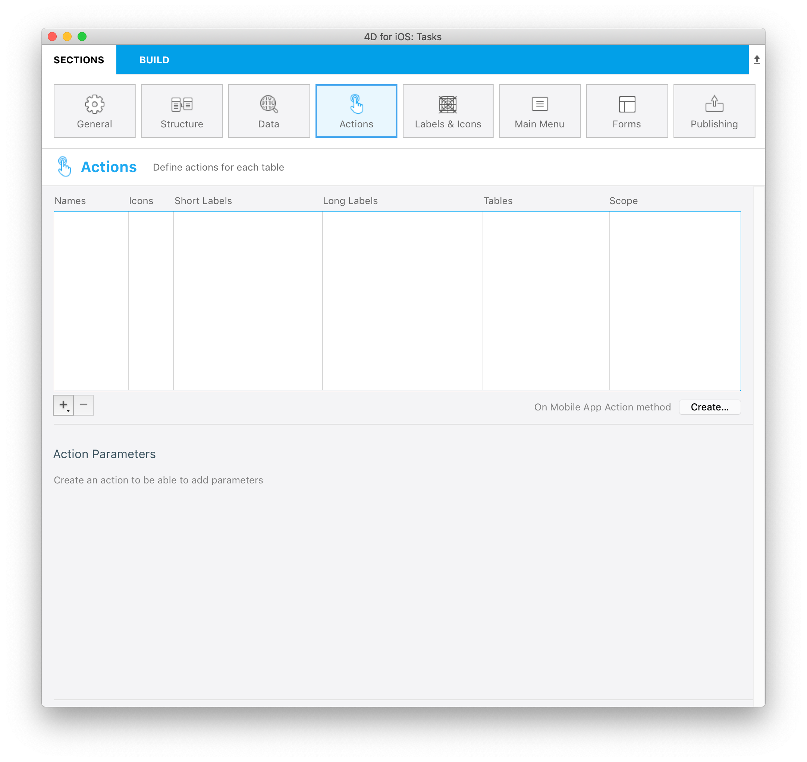

It's quite empty for the moment... Here is what we want: **create a new task from the iOS app**.

For this, let's create an action using a preset **Add** action:

* Click on the arrow in the **+ button** at the bottom of the Actions table.
* Select the **Add action for** option.
* Select the **Task table**. 

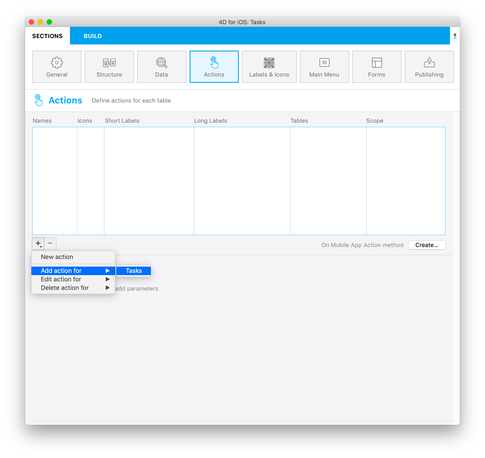

* **A new action** named *"addTasks"* with *"Add..."* as default label is displayed.
* All available **parameters** and their **properties** are shown in the **Actions Parameters** section.

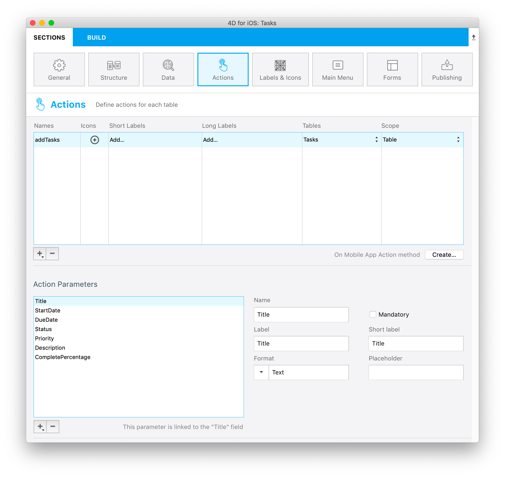

At this point, all **Add action parameters** are created automatically and ready to use.

## STEP 2. Edit action

Now let's create an action that will allow you to **edit your app content**.

For this, we'll create an action using a preset **Edit** action:

* Click on the arrow in the **+ button** at the bottom of the Actions table.
* Select the **Edit action for** option.
* Select the Tasks table. 

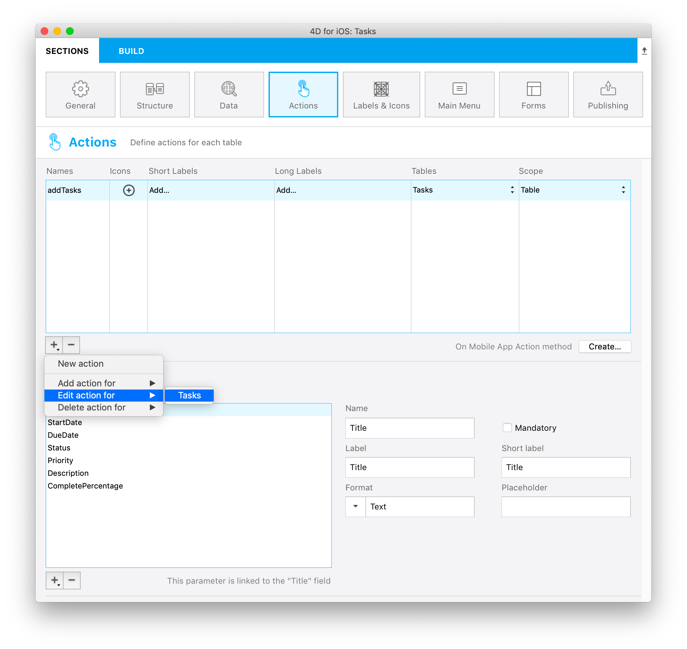

At this point, you will see:

* **A new action** named *"editTasks"* with *"Edit..."* as the default label.
* All available action **parameters** and their **properties** are displayed in the **Actions parameters** section.


Don't worry, we'll handle the 4D code for these actions later. :-)

## STEP 3. Delete action

The preset **Delete** action creation process is nearly the same as the Edit action:

* Click on the arrow in the **+ button** at the bottom of the Actions table.
* Select the **Delete action for** option.
* Select the Tasks table. 

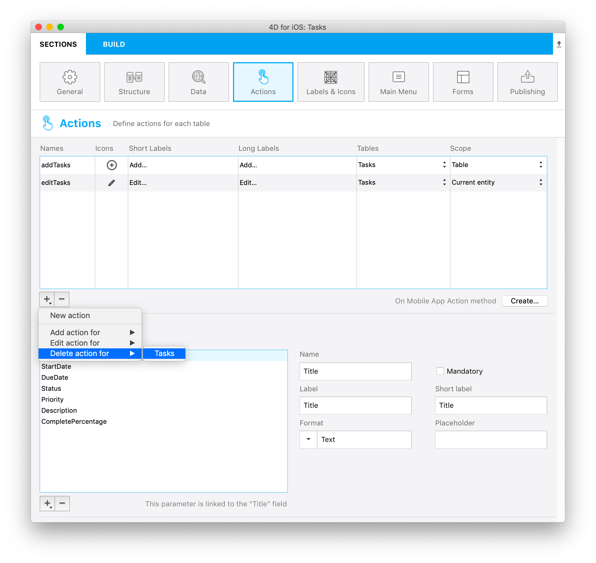

At this point, you will see a **new action** named *"deleteTasks"* with *"Remove"* as the default label.

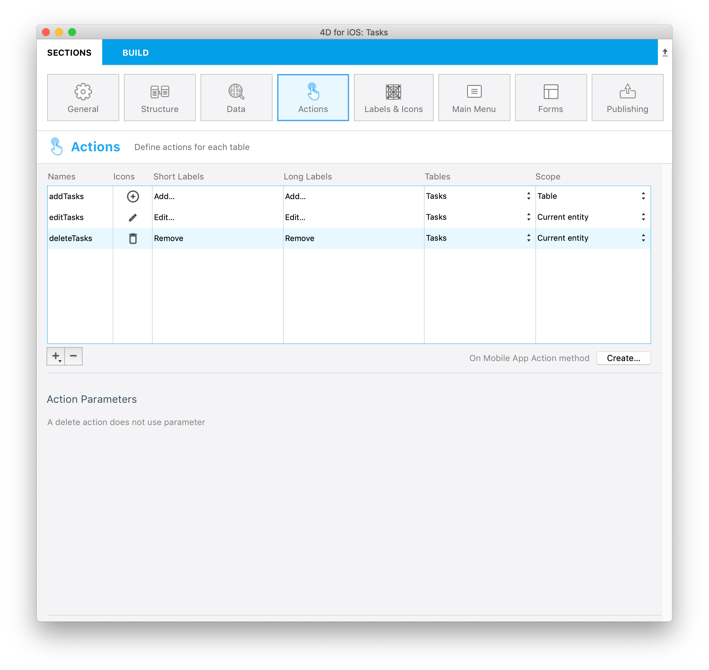

You don't need to worry about parameters or properties for this type of action.

## STEP 4. Send a comment action

Now we want to **send a comment** to a **specific email** depending on a specific task. To do so, click on the + button and create a new action named **sendComment**.

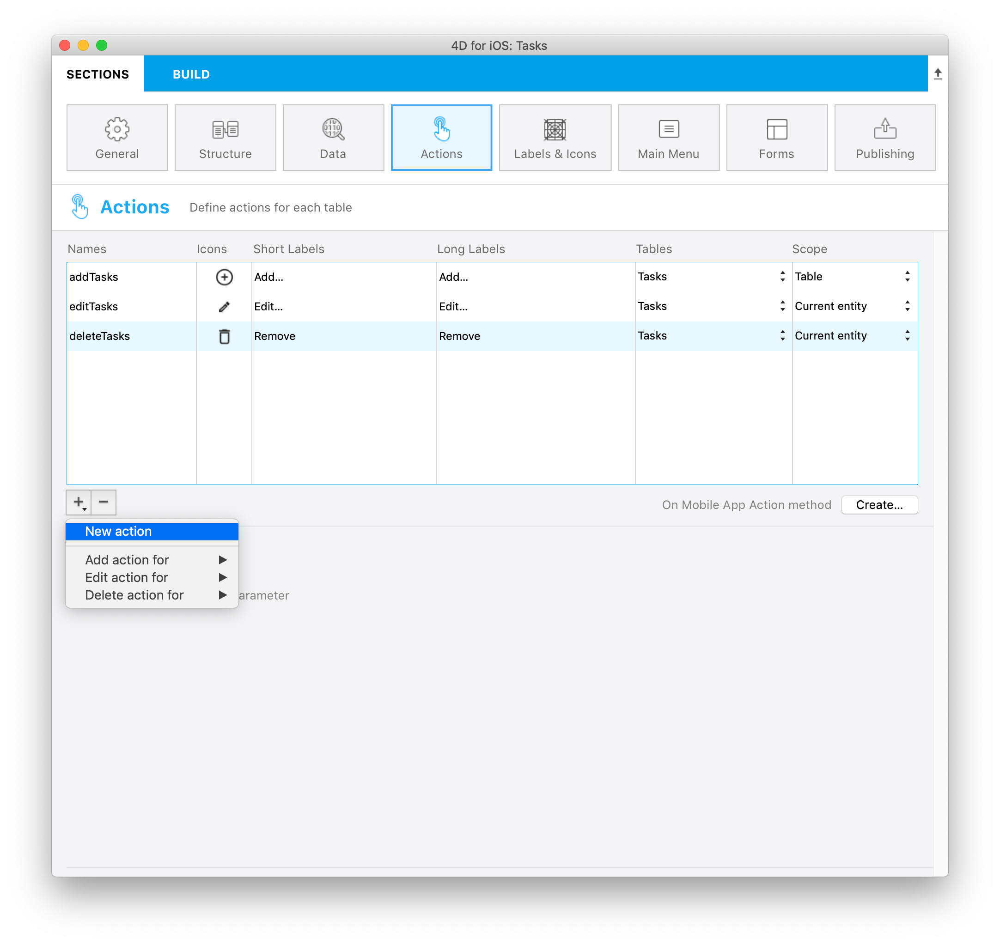

Now let's create three parameters:

* Click on the + button and select **Title** in the Action Parameters list to include it in the email you're going to send.
* Create a **Comment** parameter and select Text area as the format property.
* Create an **email** parameter and select Email address as the format property.

Your Actions section should look like this:

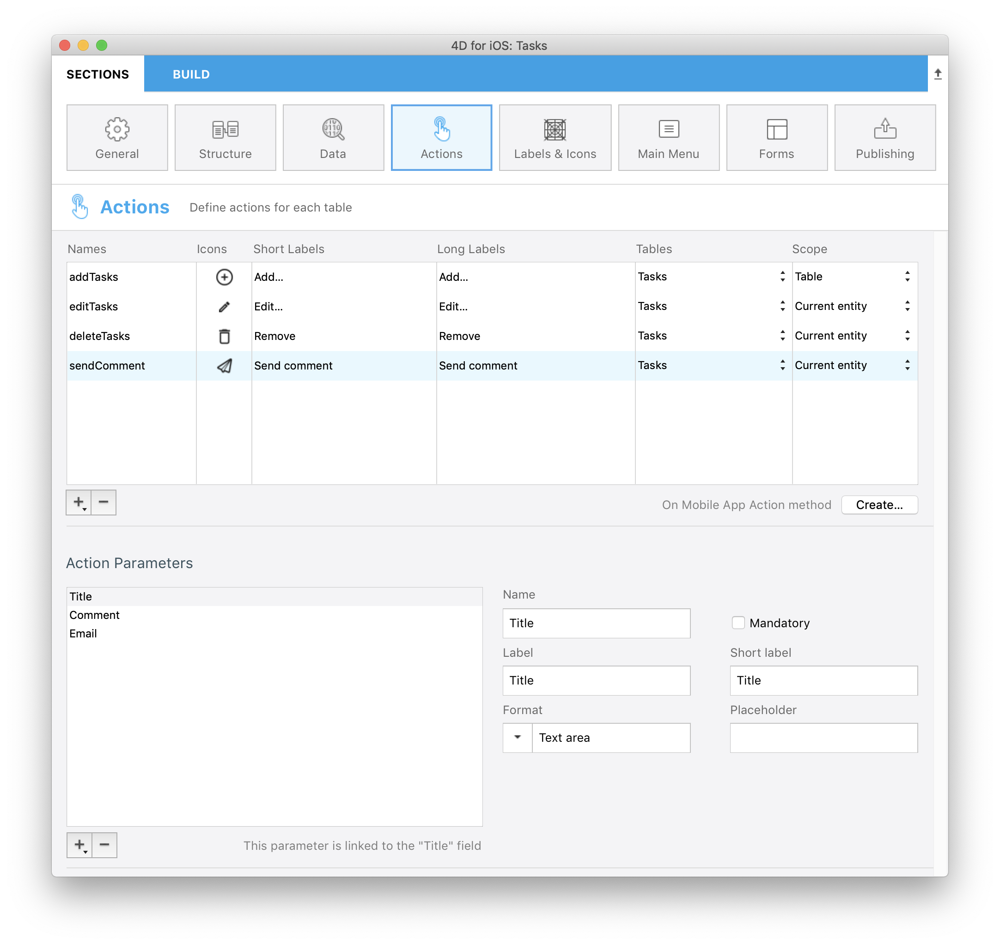

## STEP 5. Create the On Mobile App Action

As described in the [documentation](actions.html), click on the Create button to create the *On Mobile App Action* database method.

All of your actions will automatically be included in this database method.

The only thing you need to do is add a reference to your method(s) for the scenario(s) your want to handle.

Here's the final *On Mobile App Action* database method:

```code4d
C_OBJECT($0;$response)
C_OBJECT($1;$request)

C_OBJECT($o;$context;$request;$result;$parameters)

$request:=$1  // Informations provided by mobile application

$context:=$request.context
$parameters:=$request.parameters

Case of 
		
	: ($request.action="addTasks")
		
		  // Insert here the code for the action "Add…"
		
		$o:=New object(\
		"dataClass";$context.dataClass;\
		"parameters";$parameters)
		
		$result:=addAction ($o)
		
	: ($request.action="editTasks")
		
		  // Insert here the code for the action "Edit…"
		
		$o:=New object(\
		"dataClass";$context.dataClass;\
		"ID";$context.entity.primaryKey;\
		"parameters";$parameters)
		
		$result:=editAction ($o)
		
		
	: ($request.action="deleteTasks")
		
		  // Insert here the code for the action "Remove"
		
		$o:=New object(\
		"dataClass";$context.dataClass;\
		"ID";$context.entity.primaryKey)
		
		$result:=deleteAction ($o)
		
	: ($request.action="sendComment")
		
		  // Insert here the code for the action "Send Comment"
		
		$o:=New object(\
		"dataClass";$context.dataClass;\
		"ID";$context.entity.primaryKey;\
		"parameters";$parameters)
		
		
		$result:=sendMail ($o)
		
	Else 
		
		  // Unknown action
		
End case 

$0:=$result

```

## STEP 6. Create All the methods you need


### addAction

```code4d
C_OBJECT($0)
C_OBJECT($1)

C_OBJECT($entity;$in;$out)

$in:=$1

$out:=New object("success";False)

If ($in.dataClass#Null)
	
	$entity:=ds.Tasks.new()  //create a reference
	
	For each ($key;$in.parameters)
		
		$entity[$key]:=$in.parameters[$key]
		
	End for each 
	
	$entity.save()  //save the entity
	
	
	$out.success:=True  // notify App that action success
	$out.dataSynchro:=True  // notify App to refresh the selection
	$out.statusText:="Task added"
	
Else 
	
	$out.errors:=New collection("No Selection")
	
End if 

$0:=$out


```

### editAction

```code4d
C_OBJECT($0)
C_OBJECT($1)

C_OBJECT($dataClass;$entity;$in;$out;$status;$selection)

$in:=$1

$selection:=ds[$in.dataClass].query("ID = :1";String($in.ID))

If ($selection.length=1)
	
	$entity:=$selection[0]
	
	For each ($key;$in.parameters)
		
		$entity[$key]:=$in.parameters[$key]
		
	End for each 
	
	$status:=$entity.save()
	
	$out:=New object
	
	If ($status.success)
		
		$out.success:=True  // notify App that action success
		$out.dataSynchro:=True  // notify App to refresh this entity
		$out.statusText:="Task edited"
		
	Else 
		
		$out:=$status  // return status to the App
		
	End if 
	
Else 
	
	$out.success:=False  // notify App that action failed
	
End if 

$0:=$out


```

### deleteAction

```code4d

C_OBJECT($0)
C_OBJECT($1)

C_OBJECT($dataClass;$entity;$in;$out;$status;$selection)

$in:=$1

$selection:=ds[$in.dataClass].query("ID = :1";String($in.ID))

If ($selection.length=1)
	
	$entity:=$selection.drop()
	
	$out:=New object
	
	If ($entity.length=0)
		
		$out.success:=True  // notify App that action success
		$out.dataSynchro:=True  // notify App to refresh this entity
		$out.statusText:="Task deleted"
		
	Else 
		
		$out:=$status  // return status to the App
		
	End if 
	
Else 
	
	$out.success:=False  // notify App that action failed
	
End if 

$0:=$out


```

### sendEmail

```code4d
C_OBJECT($0;$out)
C_OBJECT($1;$in)

C_OBJECT($dataClass;$entity;$selection)

$in:=$1

$selection:=ds[$in.dataClass].query("ID = :1";String($in.ID))

If ($selection.length=1)
	
	$entity:=$selection[0]
	
	For each ($key;$in.parameters)
		
		$entity[$key]:=$in.parameters[$key]
		
	End for each 
	
	$out:=New object
	
	$server:=New object
	$server.host:="smtp.gmail.com"
	$server.port:=465
	$server.user:="test@mail.com"
	$server.password:="yourPassword"
	
	$transporter:=SMTP New transporter($server)
	
	$email:=New object
	$email.subject:="New comment about one of your task"
	$email.from:="yourEmail"
	$email.to:=$emailToSend
	$email.htmlBody:="<h1>Comment from Tasks for iOS</h1>"+"<p><b>Task:</b> "+$taskTitle+"</p><p><b>Comment:</b> "\
	+$commentToSend+"</p><br><p><i>Send from my 4D for iOS app</i></p>"\
	
	$status:=$transporter.send($email)
	If ($status.success)
		$out.success:=True  // notify App that action success
		$out.statusText:="Mail sent"
		
	Else 
		$out.success:=False  // notify App that action failed
		$out.statusText:="Mail not sent"
		
	End if 
	
Else 
	
	$out.success:=False  // notify App that action failed
	
End if 

$0:=$out


```

*Don't forget to add your own values for the **sendEmail** action.


## STEP 7. Build your app


It's time to build your app! 

Now, if you click on the Action button in the navigation bar, you'll be able to **create a new task**.

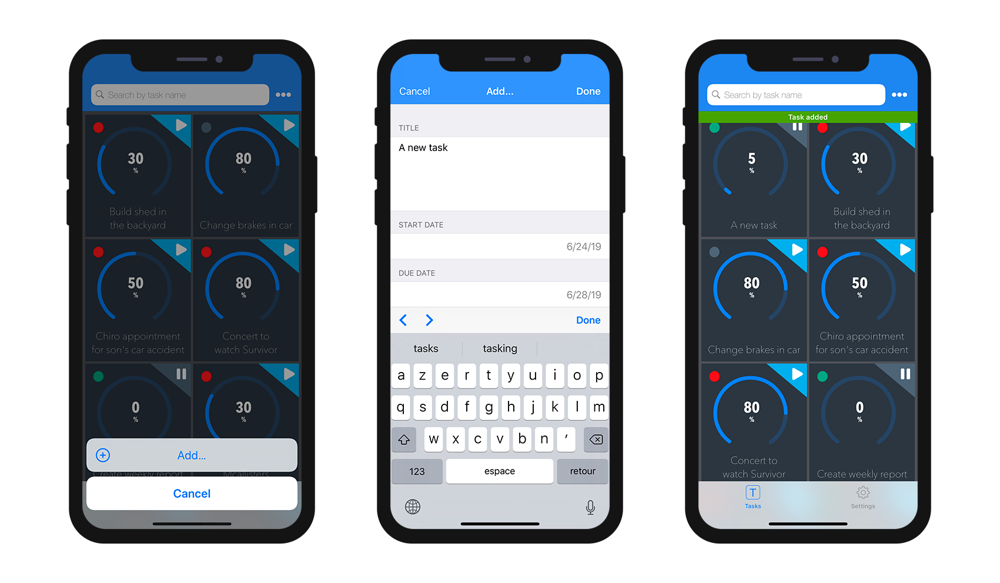

Holding and maintaining pressure on your new task cell in the List Form, will show that an **Edit...** action is available in the action list.

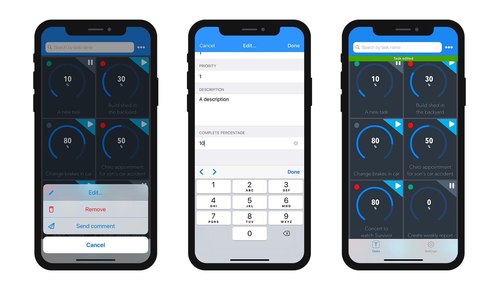

Send a comment using the **Send comment** action.


And finally you can delete an entity using the **Delete...** action.

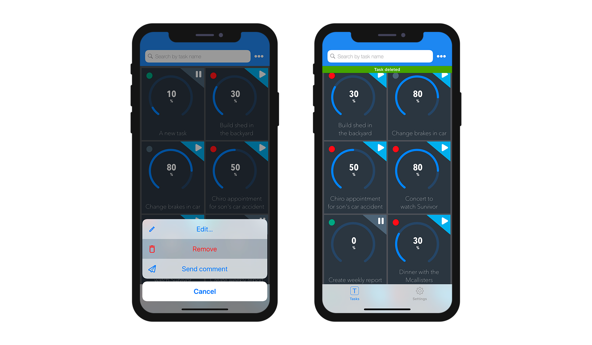

## STEP 8. Where to go from here?

Congratulations! Your Tasks iOS app is now complete and you can now modify your app data direclty from your device and sychronize it with your server!

<div markdown="1" style="text-align: center; margin-top: 20px; margin-bottom: 20px">

<a class="button"
href="../assets/en/actions/ActionParametersFinalProject.zip">FINAL PROJECT</a>

</div>

