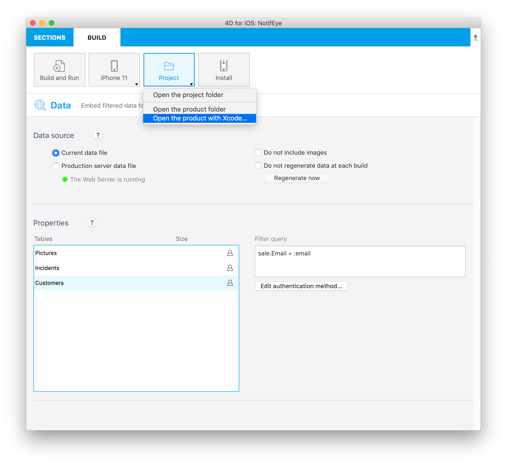

If you have issues during the build process, you can open your generated project with Xcode by selecting the **Open the product with Xcode** option from the **Project** Menu. 

From here, select **launch your application** in the Simulator by clicking on the **Build** button and get all of the logs at the bottom of the Xcode workspace.

## Logger

A logger is an object that allows you to log and trace operations. 

For this, we use the [XCGLogger](https://github.com/DaveWoodCom/XCGLogger) framework.

You will find the logger settings definition in your Xcode project/Settings/Settings.plist file.

## Levels

You can filter and display different log levels in your console by adding log.level to your Settings.plist file.

To do so, add a row by right clicking inside the Settings.plist file and enter:
* log.level as **Key**
* Number as **Type**
* 3 as **Value** (for example)

The **available values** are the following :

* 0 for verbose
* 1 for debug
* 2 for info (default value)
* 3 warning
* 4 error
* 5 severe

For this example, if you set the log.level **Value** to 3, you will get **warning, error and sever** in your Xcode console.

## Format

You can display different visual indicators in the Xcode console to **highlight different log types**.

To do so, just open your Xcode project/Settings/Settings.plist file.

### Emoticons

 * prefixes[.verbose] = "🗯"
 * prefixes[.debug] = "🔹"
 * prefixes[.info] = "ℹ️"
 * prefixes[.warning] = "⚠️"
 * prefixes[.error] = "‼️"
 * prefixes[.severe] = "💣"

### Circles

* prefixes[.verbose] = "🔘"
* prefixes[.debug] = "🔵"
* prefixes[.info] = "⚪"
* prefixes[.warning] = "☢️"
* prefixes[.error] = "🔴"
* prefixes[.severe] = "⚫"

