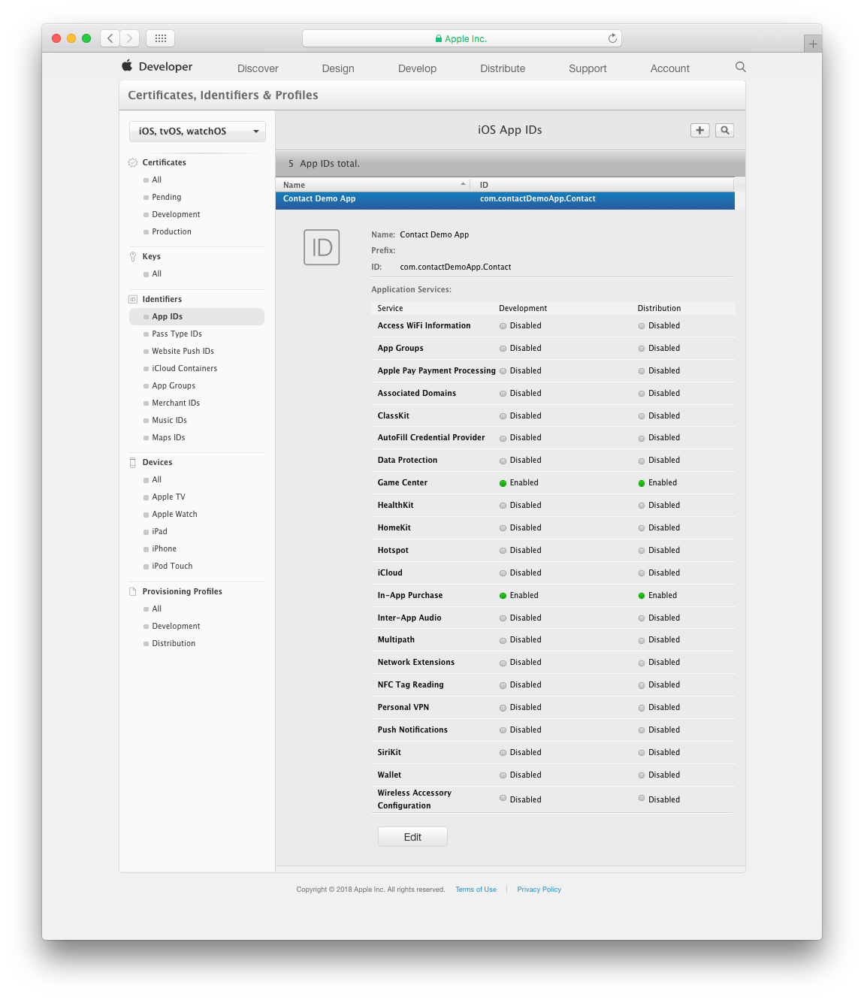
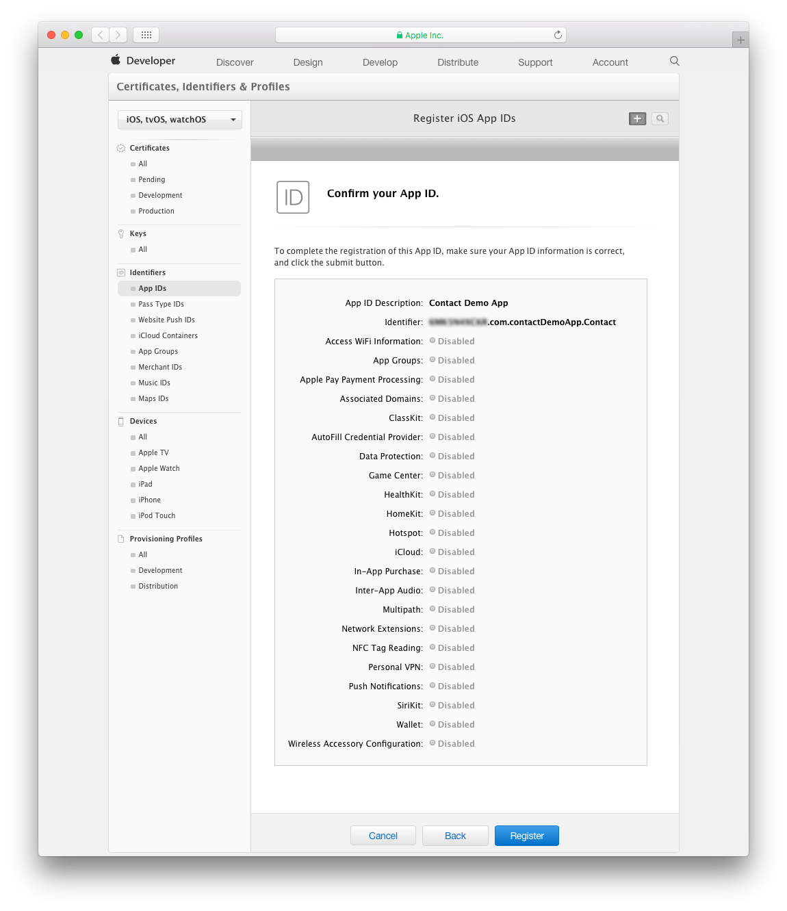
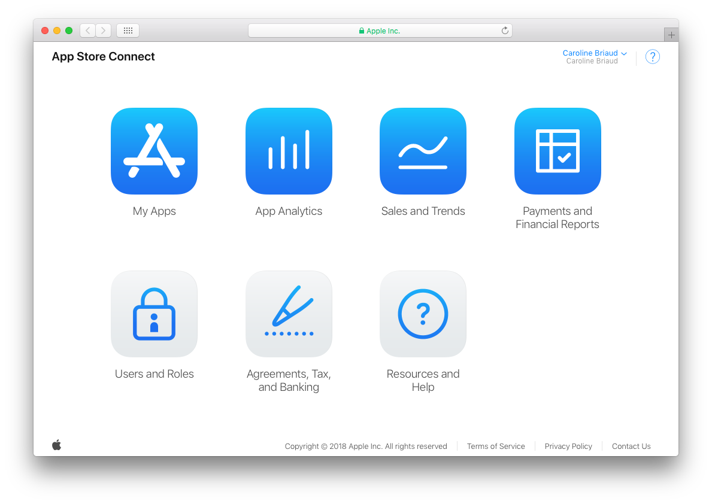
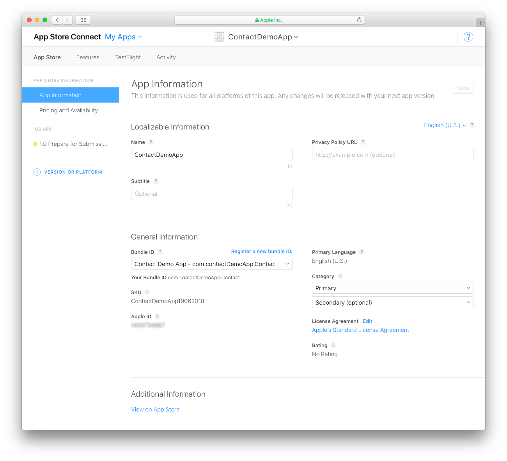

<b>OBJECTIVES</b>

* Create an App ID on your Developer Account
* Create your app in App Store Connect

## STEP 1. Create an App ID

#### What is an App ID ?

<i>An App ID is a two-part string used to identify one or more apps from a single development team. The string consists of a Team ID and a Bundle ID search string, with a period (.) separating the two parts (ex: TeamID.BundleID).</i>

<b>NOTE</b>
 
* If you have chosen an Apple Developer Account as an individual, your account is available immediately and you can create your App ID.

* If your have chosen an Apple Developer Account as an organization, you must wait for Apple validation to create your App ID.

* To create your App ID, go to your developer account and select [Certificates, IDs & Profile](https://developer.apple.com/account/ios/identifier/bundle)

* Click the + sign next to <i>Register iOS App IDs</i> to add a new App ID. 

* Define your app's Name and Bundle ID. 

* Define the App Services to include in your app

* Confirm your App ID by clicking <b>Register</b>.

## STEP 2. Sign in to App Store Connect

* Sign in to your [App Store Connect Account](https://appstoreconnect.apple.com)

* Click on <b>My Apps</b>.

## STEP 3. Create a new iOS App

Click the <b>+</b> sign in the top left corner to create a new iOS App. 

Add the following information:

* <b>Platforms</b>: Select iOS.
* <b>Name</b>: The name of your app.
* <b>Primary language</b>: The main language for your app.
* <b>Bundle ID</b>: Select your App Bundle ID from the dropdown list.
* <b>SKU</b>: A unique ID for your app (this stays private and is not seen by users)
* <b>Limit User Access (optional)</b>: Allows you to limit access to your app to users with App Manager, Developer, Marketer, or Sales roles.

<b>NOTE</b>

If your Bundle ID is not available, it may already be used by another app in the App Store. You'll need to change yours in your Xcode project.

## STEP 4. App information

From App Store Connect > App Information:
* Define your app's Privacy Policy URL (optional).
* Enter a subtitle for your app. This will appear below your app's name throughout the App Store in iOS 11.
* Select a primary and secondary (optional) category for your app to appear in.

## STEP 5. Pricing and Availability

This is where you define the price for your app.

<b>TIPS</b>

You can define limited-time discounts by specifying start and end dates.

## STEP 6. Prepare for Submission

Add all of the assets for your app to appear in the App Store in <b>Version Information</b>:

* Add your app screenshots. Screenshots for the iPhone 5.5" Super Retina Display and iPad 12.9" Retina Display are mandatory. For more details, see [Screenshot specifications](https://help.apple.com/app-store-connect/#/devd274dd925).

<b>TIPS</b>

You can generate all of your screenshots in Simulator (File > New Screen Shot).

* Scroll down and define the <b>Keywords</b> and complete the <b>Description</b> (this is what users will see in the App Store).

* You can share updates about your app, including new promotions or in-app purchases, upcoming features or content, limited- time sales, or other events within your app in also add a <b>Promotional Text</b> that will appear above your description on the App Store (for customers with devices running iOS 11 or later).

* Enter a <b>Support URL</b> that includes support information for your app. This URL will be visible on the App Store.

* <b>Marketing URL</b> is optional. This can direct users to a marketing website for your app.	

In the <b>iOS App section</b>:

Locate your build versions in <b>Build</b>.

* In <b>General App Information</b> area, enter the Copyright, Version, and Trade Representative Contact Information for your app.

* Your app icon is included in the generated 4D for iOS project.

* Rating is a required property used by the App Store's parental controls. Click Edit and select the appropriate age category for your app.

The <b>App Review Information</b> and <b>Version Release</b> sections include information required by the App Store. The information provided here will not be seen by users.

* <b>App Review Information</b>: Confidential contact and security information. 
* <b>Version Release</b>: Specifies an automatic or manual publication.

* Finally, click <b>Save</b>.

