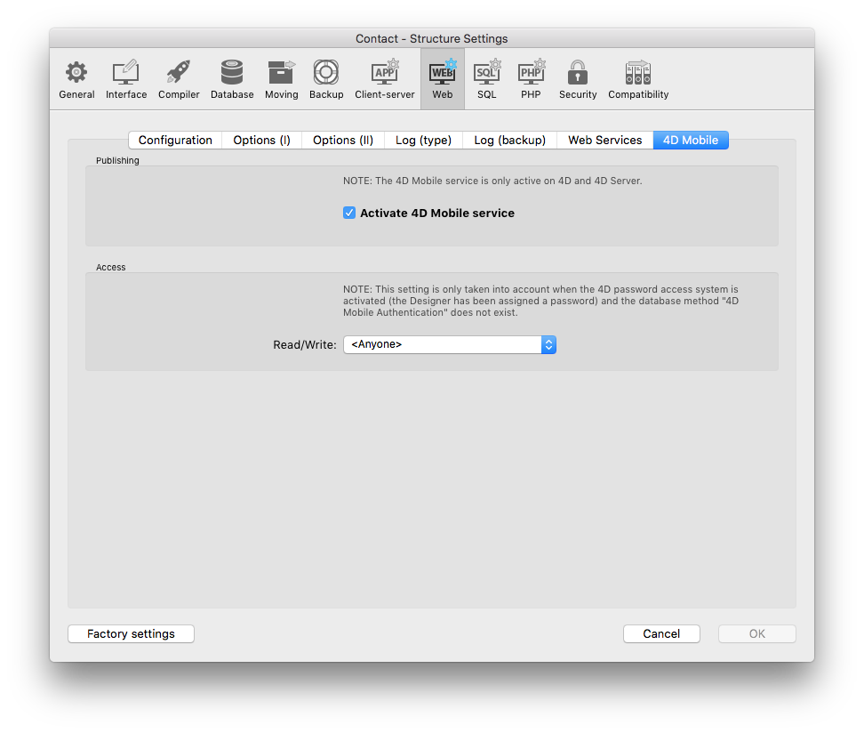
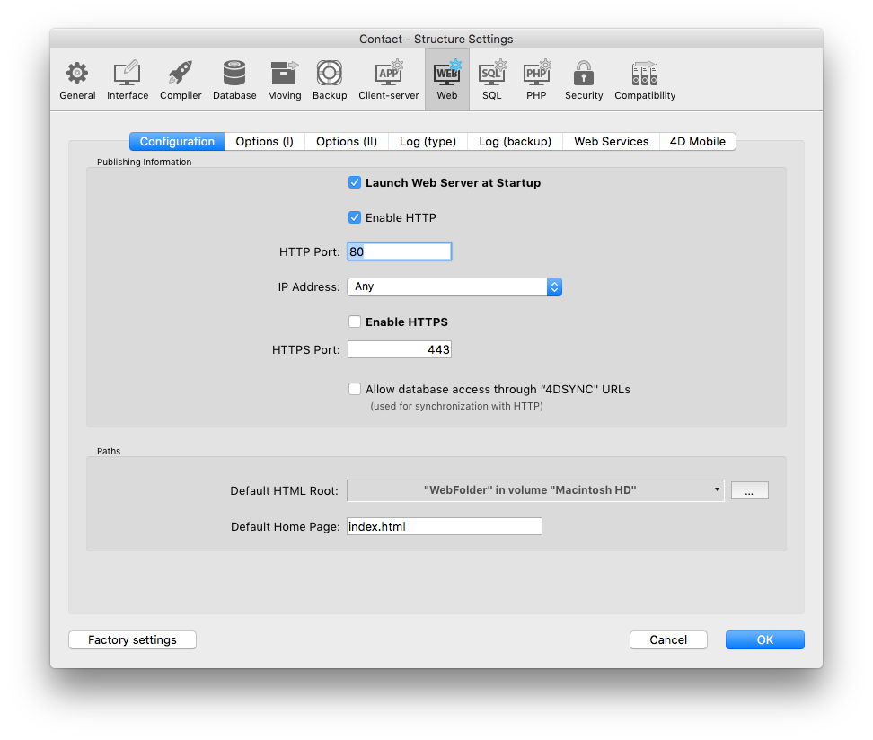
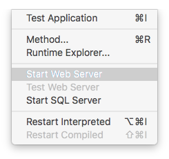

## Software requirements

* 4D Developer Pro v17 R2 64-bit (Development)
* 4D Server v17 R2 64-bit (Deployment) 
* 4D for iOS in v17 R2 is designed and certified for Xcode 9.4.1.
* The next release (4D v17 R3) will be certified for Xcode 10/Swift 4.2 (requiring macOS 10.13.6 or 10.14)
* [Apple configurator 2](https://itunes.apple.com/us/app/apple-configurator-2/id1037126344) installed on your Mac (optional). 
Install this software if you want to automate app installation on your physical device.

## Hardware requirements

* 8GB of RAM (Minimum recommended)

## Configuration

* In the 4D Database Settings, display the Compatibility page and check **Use object notation to access object properties (Unicode required).**

*Unicode mode: Used to enable or disable the Unicode mode for the current database.*

* In the 4D Database Settings, display the Web/4D Mobile page and check **Activate 4D Mobile service**.

* Tables and fields must be **exposed with 4D Mobile Service**. Display the Table Inspector in the Structure Editor and select the table to modify. By default, **Expose with 4D Mobile Service** is enabled.

* Your HTTP and HTTPS ports must be well-configured. HTTPS is mandatory for  4D for iOS deployment.

* Your Web Server must be started. It's available from the Run menu:

