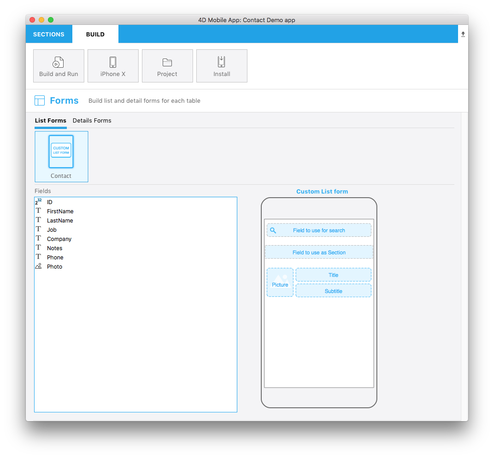

The template.svg file is a basic visual representation of a template. In this file, you'll need to define areas in order to be able to add fields to your list form template from the project editor.

Here's a finished version:




Open the template.svg file with your favorite code editor.

Let’s focus on the different parts of your svg file and what you'll need to edit.

## Title
```
<title>Custom List form</title>
```

Add the title for your template here.

## ios:values

```
<text id="cookery" ios:values="search,section,f1,f2,f3"/>
```

Inclues IDs which define your form areas:
- **search ID**: Refers to the search field area. This will allow you to drag and drop a field as the search criteria in your list form (optional).
-  **section ID**: Refers to the section field area. This will allow you drag and drop a field as the sort criteria in your list form (optional).
-  **f1, f2 and f3 IDs**: Refers to the fields to display in each cell of your list form. This will allow you to drag and drop fields to appear in your list form cells.

## Area position, height, width and type
You'll be able to define the position, height and width for:
* Searchfield
* Sectionfield
* Other general fields that will be displayed in each table cell

### SearchableField area:

```
//1
<g transform="translate(0,60)”>

//2
<rect class="bg field" x="14" y="12" width="238" height="30”/> 

//3
<path class="magnifyingGlass" transform="translate(20,8) scale(1)”/>

//4
<textArea id="search.label" class="label" x="14" y="8" width="238">$4DEVAL(:C991("fieldToUseForSearch"))</textArea>

//5
<rect id="search" class="droppable field optional" x="14" y="0" width="238" height="30" stroke-dasharray="5,2" ios:type=“0,1,2,4,8,9,11,25,35"  ios:bind="searchableField”/> 

//6
<use id="search.cancel" x="224" y="1" xlink:href="#cancel" visibility="hidden”/> //6
</g>
```

1. Entire area Y position
2. Area background position, height and width
3. Icon to display a magnifying glass icon into the searchable field
4. Define the text area position and width 
5. Define the droppable field position, height and width as well as accepted **field types**
5. Define a cancel button that will be displayed to delete the current content

The searchable field is optional.

<div markdown="1" class = "tips">

**NOTE**

* All Field and Variable Types are available [here](http://doc.4d.com/4Dv17/4D/17/Field-and-Variable-Types.302-3729410.en.html)

</div>


<div markdown="1" class = "tips">

**TIP**

* To make field type definition easier, 4D for iOS allows your to include field types with **positive values** and also exclude field types with **negative values**. For example ```ios:type=“-3,-4"``` will allow you to drag and drop every field exept images and dates.

</div>

### SectionField area:

```
//1
<rect class="bg field" x="10" y="110" width="246" height="30”/>

//2 
<textArea id="section.label" class="label" x="10" y="118" width="246">$4DEVAL(:C991("fieldToUseAsSection"))</textArea>

//3
<rect id="section" class="droppable optional" x="10" y="110" width="246" height="30" stroke-dasharray="5,2" ios:type="0,1,2,4,8,9,11,25,35" ios:bind="sectionField”/>

//4
<use id="section.cancel" x="224" y="111" xlink:href="#cancel" visibility="hidden"/>
```

1. Area background position, height and width
2. Define the text area position and width 
3. Define the droppable field position, height and width as well as accepted **field types**
4. Define a cancel button that will be displayed to delete the current content

The section field is optional.

### ImageField area:

```
//1
<g transform="translate(0,162)">

//2
<rect class="bg field" x="14" y="0" width="60" height="65"/>

//3
<path class="picture" transform="translate(-60 0) scale(5)"/>

//4
<textArea id="f1.label" class="label" x="14" y="30" width="60">$4DEVAL(:C991("picture"))</textArea>

//5
<rect id="f1" class="droppable field" x="14" y="0" width="60" height="65" stroke-dasharray="5,2" ios:type="3" ios:bind="fields[0]"/>

//6
<use id="f1.cancel" x="47" y="-2" xlink:href="#cancel" visibility="hidden"/>
</g>
```

1. Entire area Y position
2. Area background position, height and width
3. Icon to display an image in the imageField
4. Define the text area position and width 
5. Define the droppable field position, height and width as well as accepted **field types**
6. Define a cancel button that will be displayed to delete the current content

### Title Field area:

```
//1
<g transform="translate(0,162)”>

//2
<rect class="bg field" x="84" y="0" width="168" height="30”/>

//3
<textArea id="f2.label" class="label" x="84" y="8" width="168">$4DEVAL(:C991("titleField"))</textArea>

//4
<rect id="f2" class="droppable field" x="84" y="0" width="168" height="30" stroke-dasharray="5,2" ios:type="0,1,2,4,8,9,11,25,35" ios:bind="fields[1]”/>

//5
<use id="f2.cancel" x="224" y="1" xlink:href="#cancel" visibility="hidden"/>
</g>
```

1. Entire area Y position
2. Area background position, height and width
3. Define the text area position and width 
4. Define the droppable field position, height and width as well as accepted **field types**
5. Define a cancel button that will be displayed to delete the current content

### Subtitle Field area:
```
//1
<g transform="translate(0,198)”>

//2
<rect class="bg field" x="84" y="0" width="168" height="30”/>

//3
<textArea id="f3.label" class="label" x="84" y="8" width="168">$4DEVAL(:C991("subtitleField"))</textArea>

//4
<rect id="f3" class="droppable field" x="84" y="0" width="168" height="30" stroke-dasharray="5,2" ios:type="0,1,2,4,8,9,11,25,35" ios:bind="fields[2]”/>

//5
<use id="f3.cancel" x="224" y="1" xlink:href="#cancel" visibility="hidden"/>
</g>
```

1. Entire area Y position
2. Area background position, height and width
3. Define the text area position and width 
4. Define the droppable field position, height and width as well as accepted **field types**
5. Define a cancel button that will be displayed to delete the current content

Now that you have an **icon**, a **basic template description** in the manifest.json file, and your **svg file** ... let's move on to the fun part with Xcode!

