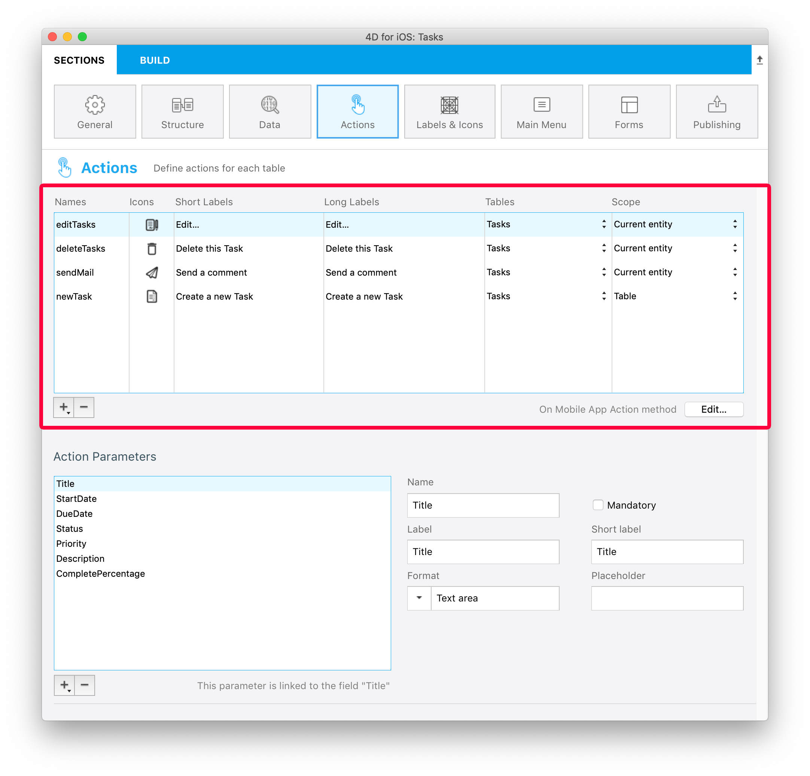
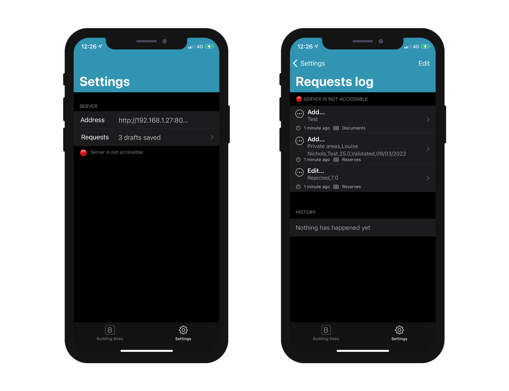
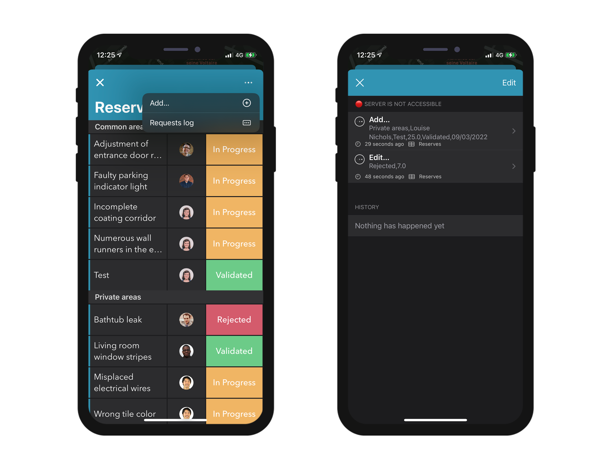

This section allows you to:

* create actions to execute 4D code from your iOS app.
* define and add parameters to your actions.

## Project Editor Side

### Create your action

You can create a new action by clicking on the + button at the bottom of the Actions table. A new line will appear in the Actions table.

Next you'll need to define the following:

* **Names:** The action name to use in the [On Mobile App Action](https://developer.4d.com/4d-for-ios/docs/en/actions.html#on-mobile-app-action) database method to trigger your 4D code.
* **Icons:** The icon to choose from your icon library. You can also add your own icon by following this [tutorial](using-icons.html).
* **Short and long Labels:** The labels for the actions to display in your app.
* **Table:** The table on which you want to apply the action.
* **Scope:** Where to use the action, an **entity** or a **table**.



### Add parameters to your action

As of **4D v17R6**, you can add **action parameters** and **edit** data directly from your app.

For each parameter, you can edit the following properties:

* Name
* Long label
* Short label
* Format
* Input constraints (define minimum or maximum values)
* Placeholder
* Mandatory field definition
* Default value


You are free to change the order of parameters using drag and drop.

Here are the different **Formats** you can select for a parameter:

<table>

<tr>
<th colspan="2"  style="text-align:center">TEXT</th>
</tr><tr style="text-align:center">
<th>Format</th><th>Description</th>
</tr><tr>
<td>Text</td><td>Capitalize the first letter of a string</td>
</tr><tr>
<td>Email Address</td><td>Optimized iOS keyboard for email entry</td>
</tr><tr>
<td>Phone Number</td><td>iOS keypad for entering telephone numbers.</td>
</tr><tr>
<td>Account</td><td>Optimized iOS keyboard for username entry</td>
</tr><tr>
<td>Password</td><td>Optimized to handle passwords</td>
</tr><tr>
<td>URL</td><td>Optimized iOS keyboard for URL entry</td>
</tr><tr>
<td>Zip Code</td><td>Optimized iOS keyboard for zip code entry</td>
</tr><tr>
<td>Text area</td><td>Includes multiple lines of text in a single field</td>
</tr><tr>
<td>Barcode</td><td>Extract barcode associated value. Supported formats : EAN8, EAN13, Code 39, Code 93, Code 128, QR Code, UPC, PDF417</td>
</tr>
<tr>
<td colspan="2"></td>
</tr>

<tr>
<th colspan="2" style="text-align:center">NUMBER</th>
</tr><tr style="text-align:center">
<th>Format</th><th>Description</th>
</tr><tr>
<td>Number</td><td>Numbers with decimals</td>
</tr><tr>
<td>Integer</td><td>Numbers without decimals</td>
</tr><tr>
<td>Scientific</td><td>Scientific Notation</td>
</tr><tr>
<td>Percentage</td><td>Percent Notation</td>
</tr><tr>
<td>Spell Out</td><td>Convert numbers into strings</td>
</tr>
<tr>
<td colspan="2"></td>
</tr>

<tr>
<th colspan="2" style="text-align:center">DATE</th>
</tr><tr style="text-align:center">
<th>Format</th><th>Description</th>
</tr><tr>
<td>Date</td><td>Nov 23, 1937</td>
</tr><tr>
<td>Short Date</td><td>	11/23/37</td>
</tr><tr>
<td>Long Date</td><td>November 23, 1937</td>
</tr><tr>
<td>Full Date</td><td>Tuesday, November 23, 1937</td>
</tr><tr>
<td colspan="2"></td>
</tr>

<tr>
<th colspan="2" style="text-align:center">TIME</th>
</tr><tr style="text-align:center">
<th>Format</th><th>Description</th>
</tr><tr>
<td>Time</td><td>3:30 PM</td>
</tr><tr>
<td>Duration</td><td>2 hours 30 minutes</td>
</tr>
<tr>
<td colspan="2"></td>
</tr>

<tr>
<th colspan="2" style="text-align:center">BOOLEAN</th>
</tr><tr style="text-align:center">
<th>Format</th><th>Description</th>
</tr><tr>
<td>Boolean</td><td></td>
</tr><tr>
<td>Check mark</td><td></td>
</tr>

<tr>
<td colspan="2"></td>
</tr>
<tr>
<th colspan="2" style="text-align:center">IMAGES</th>
</tr>
<tr>
<td>Signature</td><td>Allow to sign with the finger</td>
</tr>

</table>

### Preset actions

4D for iOS includes three preset (predefined) actions to manage your app content:

* Edit 
* Add 
* Delete 

#### 1. Add action

4D for iOS makes the **Add actions** creation process very simple.

The only thing you need to do is select the **Add action for** option, accessible from the **+ button** at the bottom of the Actions table. 


Then just **select the table** you want to link to this add action. And this is it! 

This will **automatically create** all the parameters for you in the Project Editor. In the generated app, this will allow you to edit each field value.

For those kind of action, you will see that all **properties** are already filled in for your convenience at the right side of the parameter's list.


#### 2. Edit action

**Edit actions** creation follows the same process as the Add actions, with the exception that you will not be able to define default values from the Actions section.


#### 3. Delete action

**Delete action** creation follows the same process as the Edit action. The only difference is that this action allows you to remove an entity.

To create a Delete action, select the **Delete action for** option accessible from the **+ button** at the bottom of the Actions table.

This type of action should be used with caution.


For Edit and Add actions you are free to modify the:

* parameters by adding or removing a parameter using the **+ and - buttons** at the bottom of the Action parameters list.
* properties by defining them as you wish. 

### On Mobile App Action

The [On Mobile App Action](https://livedoc.4d.com/4D-Language-Reference-17-R5/Database-Methods/On-Mobile-App-Action-database-method.301-4286697.en.html) database method is available to call all of your 4D methods. 

After creating all of your actions, just click on the Create button from the Actions table to automatically generate a *Case of* code block that includes all your action names in the *On Mobile App Action* method.

> **NOTE**
>
> * You can refresh the selection after executing an action using ```$out.dataSynchro:=True```.
> * You can notify the app user when action has been executed using ```$out.statusText:="Message you want to display"```.
> * You can also decide to force close the Edition form using ```$out.close:=True```.


## iOS app Side

In your iOS app, actions are available in different ways in your List and Detail forms, depending on the templates you select in the Forms section. 

### Table List forms

* **Entity action:** Swipe left on a cell to display the available actions in a List form. A "More" button is displayed if you've defined more than three actions per entity.


* **Table actions:** A generic actions button is available in the navigation bar to display a list of available table actions.


> **TIPS**
>
> Actions will be displayed in the same order as defined in the Action section.


### Collection List forms

* **Entity action:** Depending on the template, actions are displayed by clicking on a generic button or by maintaing the pressure on a cell.


* **Table actions:** Like the Table List forms, a generic Actions button is available in the navigation bar to display a list of availble table actions.


### Detail forms

As with Table actions in List forms, a generic Actions button is available in the navigation bar to display all your entity actions in a list. 


### Edition forms

If you have created an Edit or an Add action, as soon as you select it from the action list, an **Edition form** will appear.


From here, you can:

* edit all of your fields by selecting them, and
* validate or cancel your modifications using the **Done** or **Cancel** buttons (available in the navigation bar).

For your convenience, the Edition form includes a few **special features**:

* The keyboard type depends on the selected parameter type in the Action section.
* You can go to the next or previous field using the arrow on top of the keyboard.
* The iOS keyboard can be closed by touching anywhere outside of a field.
* Indication is given to the user when a value is not valid.
* The view focuses on empty mandatory fields when the user clicks the Done button.

### Offline mode actions

Offline actions are Action requests (Add, Edit, Delete) sent by the user when they’re working on their iOS app offline and that will be synchronised once they’re online. 

For example, a user can execute several actions related to their data (add a contact name, edit a phone number, delete an old invoice, etc.) on their iOS app even if they are offline or if the server is unreachable, and have all these pending actions consistently synchronised as soon as the network is accessible. 

To do so, all pending actions will be visualized and opened by the user from 2 levels in the app:

•	The Settings screen:
It dispalys a summary and a history of all pending and completed actions under the "Request log" tab.



•	The List & Detail forms
You can chose to display the actions by table or by entity.



## Where to go from here?

* A [tutorial](actions-getting-started.html) is available to guide you through the **action definition process**.

* Another [tutorial](action-custom-template.html) will guide you through the **action TAG integration** for custom templates.

* A final [tutorial](action-parameters.html) will guide you through the **action parameters definition**.
