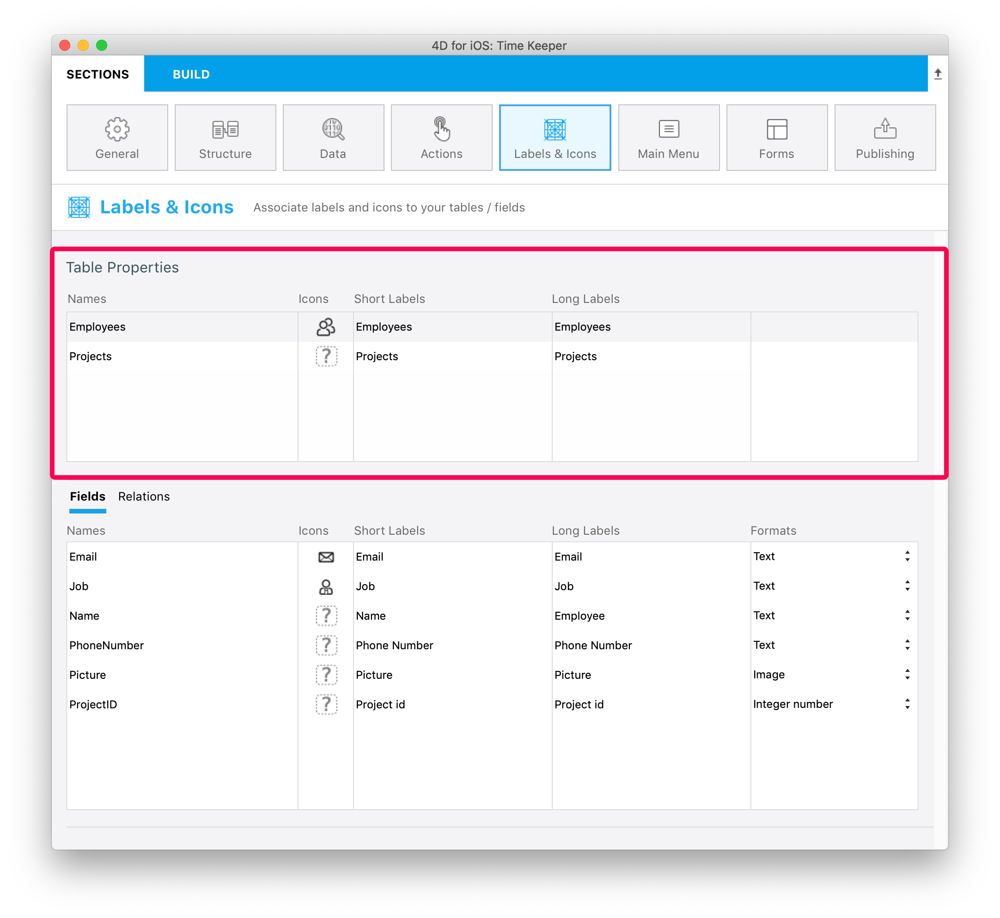
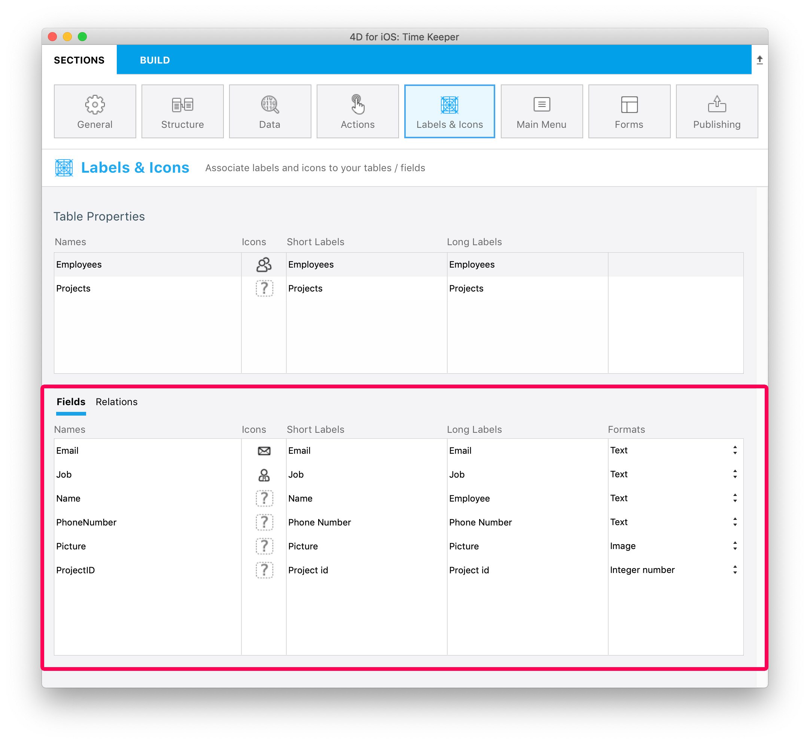

This is where you'll define properties for your tables, fields and relations:

* **Short and long labels:** used according to the available space in the template (to optimize space and avoid overcrowding the tab bar).
* **Icons:** 4D for iOS provides a large library of embedded icons to meet your needs. These include icons for business, finance, education, government, health, industry, real estate, services, etc.

* **Formats:** used to control how the values of the fields are displayed (currencies, percents...)

* **Title:** used to display a title in the destination view using relations

## Tables properties

For tables, you will be able to define the following properties:

* **Short and Long labels**
* **Icons**

## Fields properties

For fields, you will be able to define the following properties:

* **Short and Long labels:** used depending on space
* **Icons**
* **Formats:** usedto display currencies or percentage, for instance.

These elements will be displayed in detail and list forms, depending on the template of the generated app.

> **TIPS**
>
> * To keep everything consistent, **default icons** are generated for blank fields if at least one icon has been defined for a field. 
>
> * You can also leave the icon area empty if you don’t want to display icons in your application.

## Relations properties

For Relation, you will be able to define the following properties:

* **Short and Long labels:** displayed in the Relation button that allows to open a related table
* **Icons:** displayed at the left of the Relation button
* **Title:** displayed on top of the destination view when using a relation. A [tutorial](one-to-many-relations-title-definition.html) is available to guide you through the Title definition process
