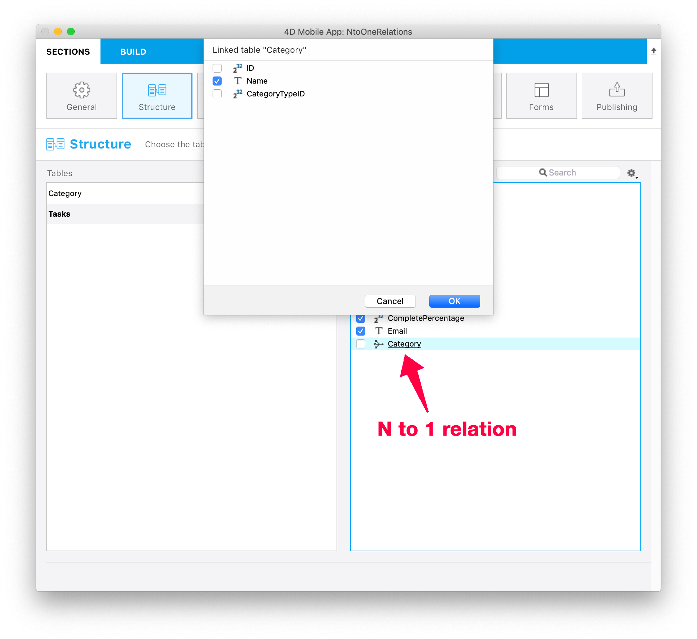

This section displays all of your database tables and fields exposed by 4D Mobile Service.


Here, you can define a subset of your physical structure to replicate for mobile devices by selecting specific tables and fields. The selected:

* tables will be automatically added to the tabs of your app.
* fields will be available later when it's time to define your list and detail forms.

## Many to One relations

* 4D 17R5 allows you to visualize table relations in the generated app publishing them from the Structure section. Then when your related fields are published, they can be used like any other field in the [app creation process](many-to-one-relations.html).



To help you define your app's structure, multiple filters and a search engine are available to make it easy to select your tables and field.

<div markdown="1" class = "tips">

**TIPS**

You can publish a selection of fields by pressing the spacebar rather than selecting them one by one.

</div>

## One to Many relations

### Deal with One to Many relations from the project editor

Now, in recent versions of 4D, you can deal with **One to Many relations** and display a list of related fields in a new page.

All you have to do is:

* publishing at least one field of the target (Many) table

* publishing the relation from the source (One) table


Then, when your related fields are published, they can be used like any other field. So you will be able to:

* Define relations properties in the [Labels and Icons](labels-and-icons.html#relations-properties) section.

* Drop the 1 to N relation in a Detail form from the Forms Section to create a link between a detail form and a related table.

### What will be created in the generated project ?

Basically a Relation button will be created in detail forms to go straight to the related view.

[Tutorials](one-to-many-relations.html) are available to help you use 1 to N relation in your 4D for iOS project.


## Incremental reload

### Enable structure adjustments

In 4D 17R5, the 4D for iOS reload becomes incremental. This means that only new, modified or deleted data from the database will be updated. This is a great optimisation in terms of loading time!

To do so, 4D for iOS needs to make structure optimizations and create:

* A ```__DeletedRecords``` table to store deleted records
* and ```__GlobalStamp``` fields to store modification stamps for each published table in your mobile application

All you need to do is enabling 4D for iOS to make the necessary structure adjustments for an optimised mobile data update. 

Once authorized, 4D for iOS will do all the work for you, and you will fully benefit from all the advantages of incrememental data reload.

<div markdown="1" class = "tips">

**NOTE**

These optimizations are required for both local and server databases.

</div>

### Pull to refresh!

iOS app side, your data is updated each time you launch your app and each time your app goes foreground, to get constant updated data.

In normal use, simply swipe down from any listform to reload your data.

From iPhone settings, you can now reset your app data and find information about your app. 


<div markdown="1" class = "tips">

**NOTE**

As soon as the admin performs an important maintenance operation, he shall alert 4D for iOS app users that a Full reload is required: Recover by tag / Restoration / Compaction

</div>
