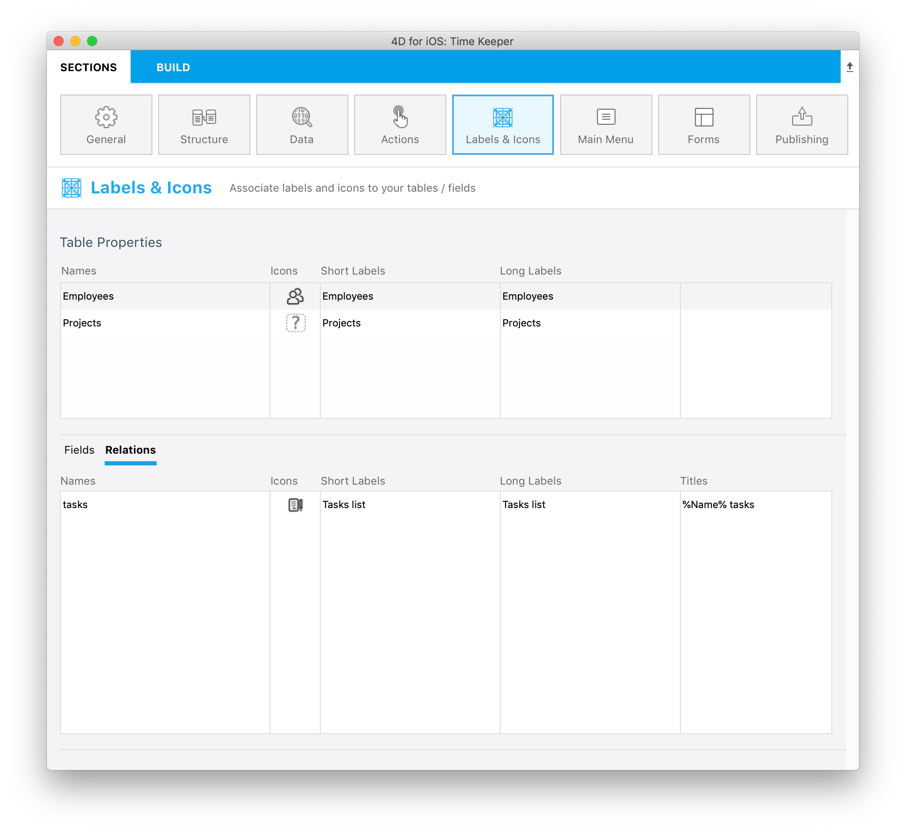
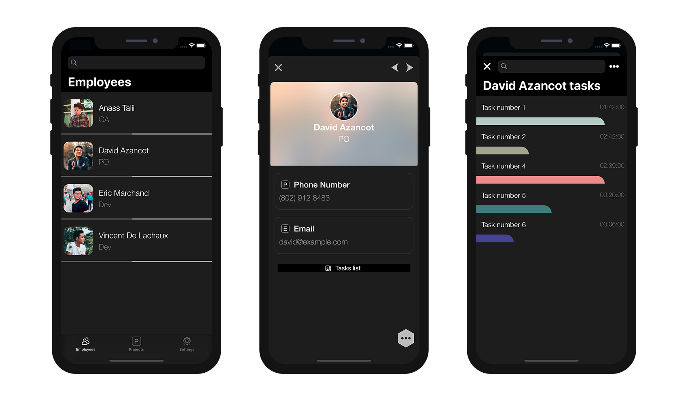

### Define a title for your destination views

To keep track of the view you come from in your app, 4D for iOS allows you to define custom Title.

In this tutorial, we will use the following project:

<div markdown="1" style="text-align: center; margin-top: 20px; margin-bottom: 20px">
<a class="button"
href="../assets/en/relations/TimeKeeper.4dbase.zip">ONE TO N STARTER PROJECT</a>
</div>

Now go straight to Open menu > Mobile project... select *Time Keeper* and go to the **Labels & Icons section**.

From here, open the relation tab to define the *tasks* relation title and enter the following line in the **Titles colomn**: ```%Name% tasks```



You probably already guessed it but in this case, it will allow you to display **Employee's Name value** on the destination view depending on the Employee detail form in which you were before. 



This is a great way to keep track of the view you come from!

Now let's see with the next tutorial how you can create and add your own Relation button!
